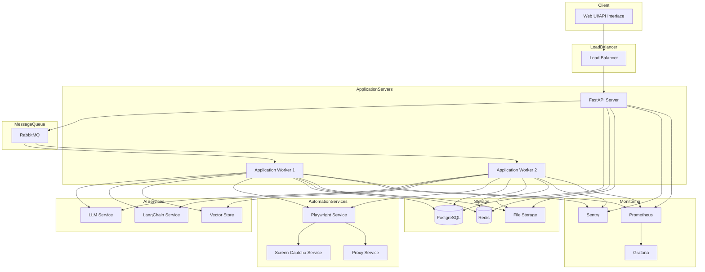
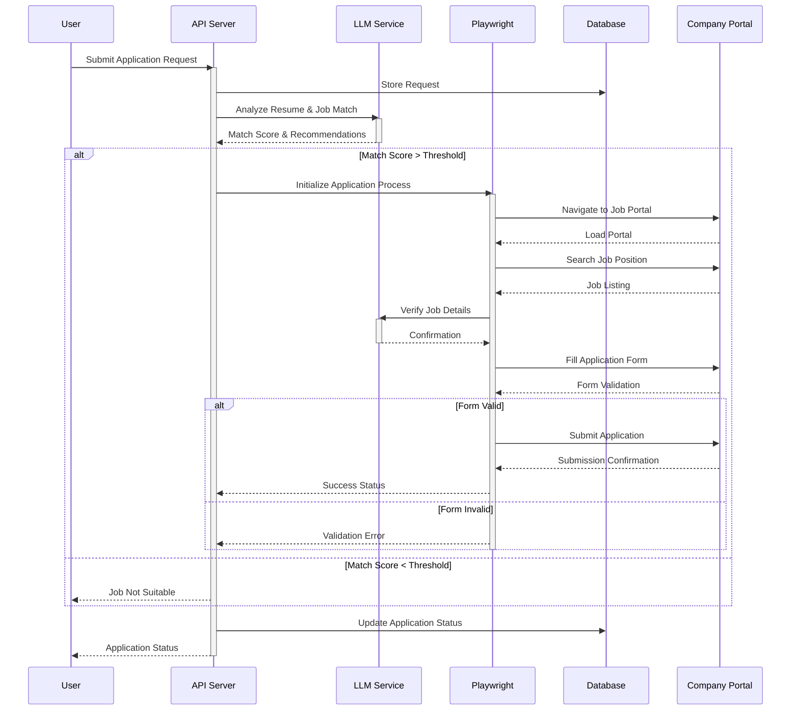
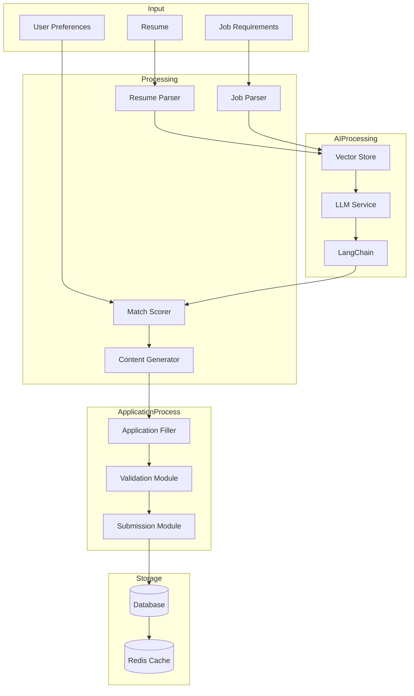
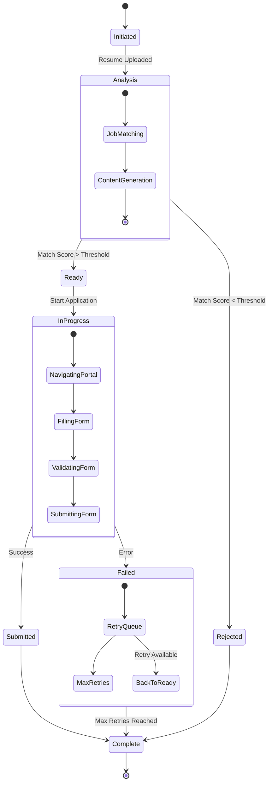

# Automated Job Application System Documentation

## 1. Overview
The Automated Job Application System is an advanced, AI-driven platform designed to automate and optimize the job application process. By leveraging LangChain, LLMs, and modern web automation technologies, the system provides intelligent job matching, automated application submission, and comprehensive tracking capabilities.

## 2. System Architecture

### 2.1 Core Components
- **Client Layer:** Web UI/API interface for user interactions
- **Application Layer:** FastAPI-based distributed system
- **AI Services:** LLM and LangChain integration for intelligent processing
- **Automation Services:** Playwright-based web automation
- **Storage Layer:** Multi-tiered data storage system
- **Monitoring Stack:** Comprehensive system observability

### 2.2 Tech Stack
- **Backend Framework:** FastAPI
- **AI/ML Stack:** 
  - LangChain for orchestration
  - Open-source LLMs for decision making
  - Vector Store (Pinecone/Weaviate) for semantic search
- **Message Queue:** RabbitMQ for job distribution
- **Databases:**
  - PostgreSQL for persistent storage
  - Redis for caching and session management
  - Vector Database for embedding storage
- **Web Automation:** Playwright with Selenium fallback
- **Containerization:** Docker + Kubernetes
- **Monitoring:** Sentry, Grafana, Prometheus

## 3. System Workflow

### 3.1 Input Processing
- Resume parsing and analysis
- Job requirement extraction
- User preference processing
- Initial compatibility assessment

### 3.2 AI-Powered Analysis
- Job-resume matching using LLMs
- Semantic search for similar positions
- Automatic content generation for applications
- Decision making for application submission

### 3.3 Application Process
1. **Pre-Application Phase:**
   - Job portal navigation
   - Position verification
   - Form identification

2. **Application Submission:**
   - Intelligent form filling
   - Document attachment
   - Validation checks
   - Submission handling

3. **Post-Application:**
   - Status tracking
   - Response monitoring
   - Analytics collection

## 4. Advanced Features

### 4.1 Intelligent Matching
- Resume-job compatibility scoring
- Skill gap analysis
- Experience mapping
- Requirement prioritization

### 4.2 Security & Reliability
- IP rotation system
- Browser fingerprint randomization
- Rate limiting and request throttling
- Session management
- Proxy pool integration

### 4.3 Error Handling
- Comprehensive retry mechanism
- Failure analysis
- Alternative path execution
- Error classification and reporting

## 5. State Management

### 5.1 Application States
- Initiated
- Analysis
- Ready
- InProgress
- Submitted
- Failed
- Complete

### 5.2 State Transitions
- Validation checkpoints
- Retry conditions
- Completion criteria
- Error state handling

## 6. Monitoring & Analytics

### 6.1 System Metrics
- Application success rate
- Processing time analysis
- Error rate tracking
- Resource utilization

### 6.2 Business Metrics
- Job match quality
- Application conversion rate
- Response time analysis
- Market trend analysis

## 7. Scalability & Performance

### 7.1 Horizontal Scaling
- Worker node management
- Load distribution
- Resource allocation
- Cache optimization

### 7.2 Performance Optimization
- Request batching
- Caching strategy
- Database optimization
- Async processing

## 8. Future Enhancements

### 8.1 Planned Features
- Machine learning-based success prediction
- Advanced document tailoring
- Interview scheduling automation
- Multi-platform integration

### 8.2 Research Areas
- Natural language generation improvements
- Enhanced bot detection avoidance
- Automated skill assessment
- Market analysis integration

## 9. Setup & Deployment

### 9.1 Prerequisites
- Docker and Kubernetes cluster
- Database systems
- Message queue system
- AI service access

### 9.2 Configuration
- Environment variables
- Service connections
- Security settings
- Monitoring setup

## 10. API Documentation

### 10.1 Main Endpoints
- `/api/v0/applications/initiate`
- `/api/v0/applications/status`
- `/api/v0/analytics`
- `/api/v0/system/health`

### 10.2 Authentication
- JWT-based authentication
- Role-based access control
- API key management

## 11. Ethical Considerations
- Rate limiting compliance
- Company policy respect
- Data privacy
- Fair use practices

## 12. Support & Maintenance

### 12.1 Monitoring
- Real-time system status
- Error tracking
- Performance metrics
- Usage analytics

### 12.2 Maintenance
- Update procedures
- Backup strategy
- Recovery plans
- System optimization

## 13. Conclusion
The Automated Job Application System represents a sophisticated solution for modern job seeking, combining AI capabilities with robust automation. Its modular architecture and scalable design ensure adaptability to evolving recruitment practices while maintaining reliability and efficiency.