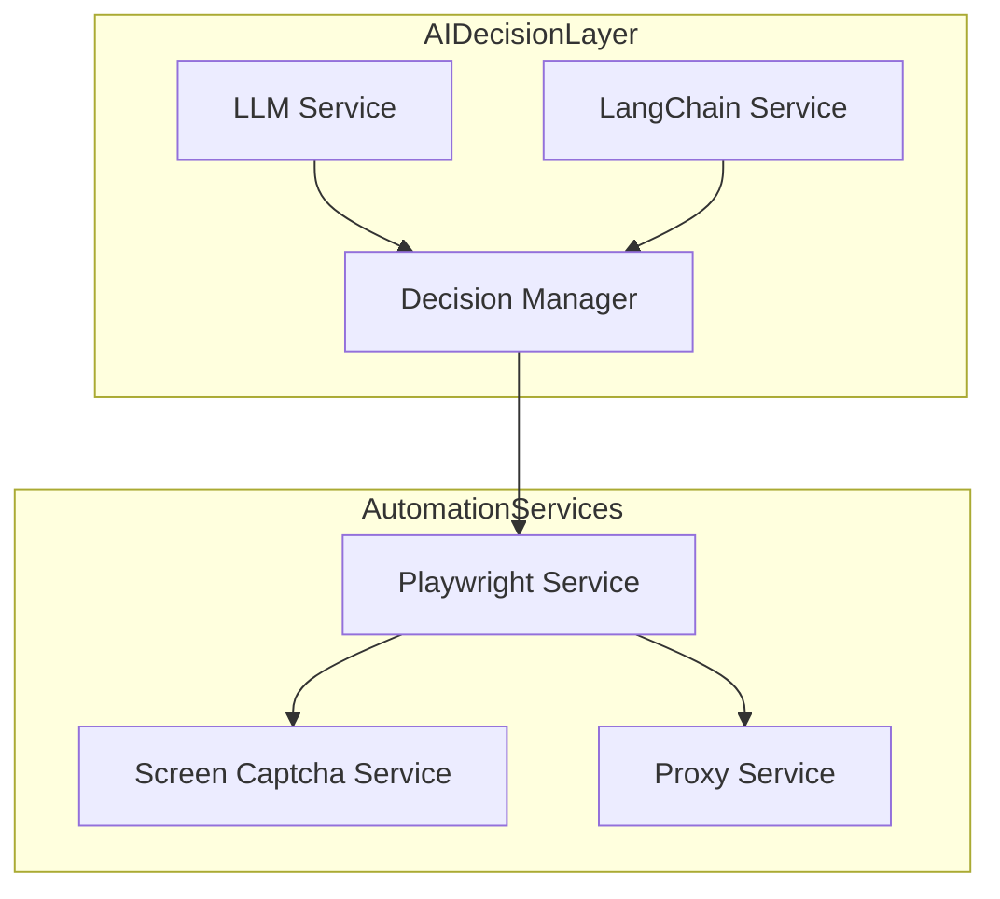
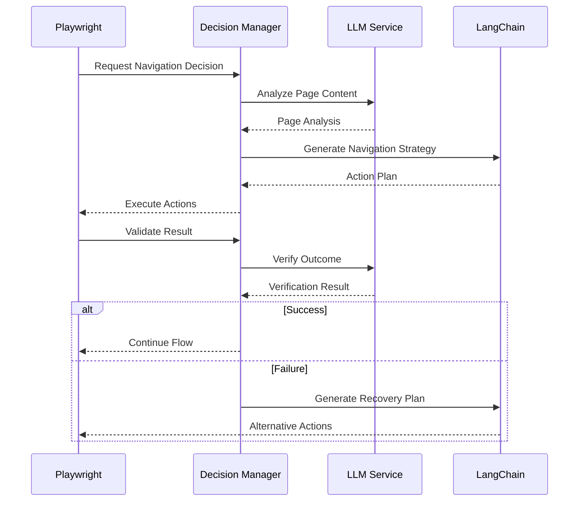
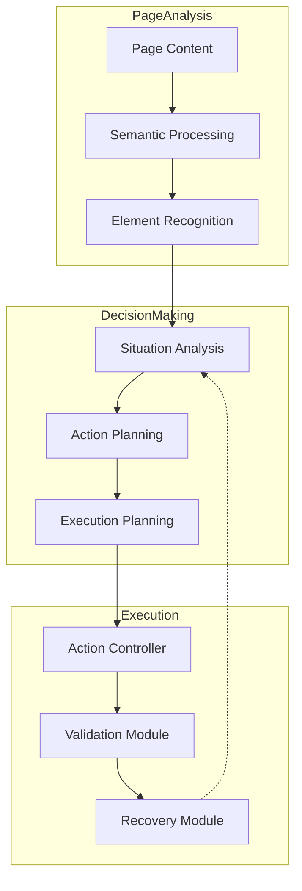

# Automated Job Application System Documentation

## 1. Overview
The Automated Job Application System is an advanced, AI-driven platform designed to automate and optimize the job application process. By leveraging LangChain and LLMs for intelligent decision-making in conjunction with Playwright for web automation, the system creates a sophisticated job application automation solution with AI-guided browsing capabilities.

## 2. System Architecture

The current architecture already includes LLM and LangChain services, but we'll enhance their integration with Playwright:



### 2.1 Enhanced AI-Guided Components
- **AI Decision Layer:**
  - LLM-based page analysis
  - Dynamic decision making for navigation
  - Form-filling strategy generation
  - Content validation and verification
  - Error recovery planning

- **Browser Automation Layer:**
  - Playwright-driven execution
  - AI-guided navigation
  - Intelligent form interaction
  - Dynamic content handling
  - Error state management

### 2.2 Tech Stack Updates
- **AI/ML Stack:** 
  - LangChain for orchestrating browser automation decisions
  - LLMs for page understanding and navigation strategy
  - Vector Store for storing and comparing page patterns
- **Browser Automation:**
  - Playwright with AI-guided decision making
  - Dynamic selector generation
  - Content-aware interaction

## 3. Enhanced System Workflow



### 3.1 AI-Guided Navigation
- Dynamic page analysis and understanding
- Intelligent element identification
- Context-aware decision making
- Adaptive navigation strategies

### 3.2 LLM Integration Points
1. **Page Analysis:**
   - Content understanding
   - Element identification
   - Form field mapping
   - Validation rules extraction

2. **Decision Making:**
   - Navigation choices
   - Form filling strategies
   - Error handling approaches
   - Recovery planning

3. **Verification:**
   - Success confirmation
   - Error detection
   - Output validation
   - Progress tracking

## 4. AI Decision Making Framework



### 4.1 LLM-Guided Navigation
- Context-aware page interpretation
- Dynamic element selection
- Intelligent form filling
- Adaptive error handling

### 4.2 Decision Points
- Navigation choices
- Form field mapping
- Content validation
- Error recovery strategies

## 5. Implementation Guidelines

### 5.1 LangChain Integration
```python
from langchain.agents import Tool, AgentExecutor
from langchain.chains import LLMChain

class BrowserController:
    def __init__(self):
        self.tools = [
            Tool(
                name="analyze_page",
                func=self.analyze_current_page,
                description="Analyze current page content"
            ),
            Tool(
                name="navigate",
                func=self.execute_navigation,
                description="Navigate to target element"
            )
        ]
        
        self.agent = AgentExecutor.from_agent_and_tools(
            agent=self.create_agent(),
            tools=self.tools,
            verbose=True
        )
```

### 5.2 Playwright Integration
```python
class AIGuidedBrowser:
    def __init__(self):
        self.browser = playwright.chromium.launch()
        self.page = self.browser.new_page()
        self.controller = BrowserController()
        
    async def navigate_with_ai(self, target):
        content = await self.page.content()
        strategy = await self.controller.agent.run({
            "page_content": content,
            "target": target
        })
        await self.execute_strategy(strategy)
```

## 6. Configuration Updates


### 6.1 System Settings
```python
config = {
    "ai_settings": {
        "model": "gpt-4",
        "temperature": 0.7,
        "max_tokens": 1000
    },
    "browser_settings": {
        "viewport": {"width": 1280, "height": 720},
        "timeout": 30000,
        "retry_attempts": 3
    }
}
```

## 7. Monitoring & Analytics Updates

### 7.1 AI Decision Metrics
- Decision accuracy rate
- Navigation success rate
- Recovery effectiveness
- Learning performance

### 7.2 Integration Metrics
- AI response time
- Decision execution time
- Recovery success rate
- System adaptation rate

## 8. Future Enhancements

### 8.1 Advanced AI Features
- Reinforcement learning for navigation
- Pattern recognition for forms
- Adaptive decision making
- Predictive error handling

### 8.2 Integration Improvements
- Real-time decision optimization
- Dynamic strategy adaptation
- Enhanced error recovery
- Improved success prediction

## 9. API Documentation

### 9.1 Main Endpoints

- `/api/v0/applications/initiate`
- `/api/v0/applications/status`
- `/api/v0/analytics`
- `/api/v0/system/health`

### 9.2 Authentication

- JWT-based authentication
- Role-based access control
- API key management


## 10. Conclusion

The Automated Job Application System represents a sophisticated solution for modern job seeking, combining AI capabilities with robust automation. Its modular architecture and scalable design ensure adaptability to evolving recruitment practices while maintaining reliability and efficiency.

## To start the local server
python -m uvicorn app.main:app --reload